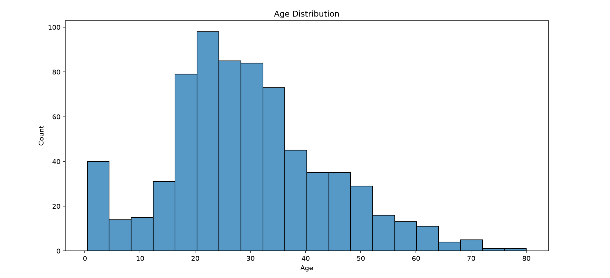
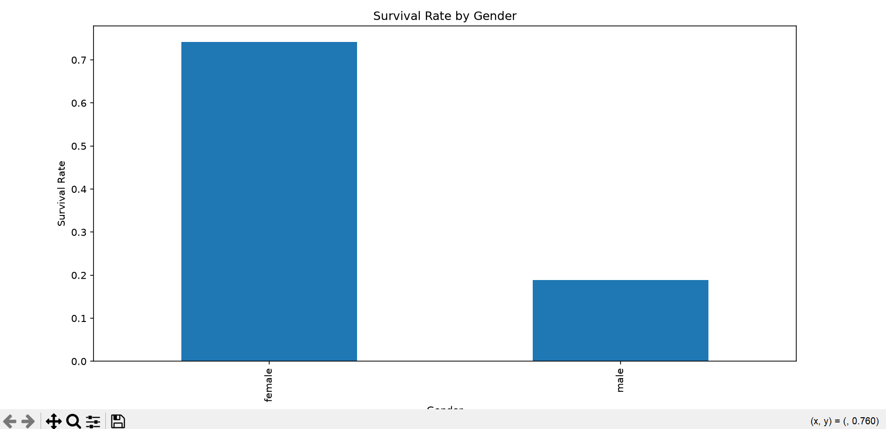
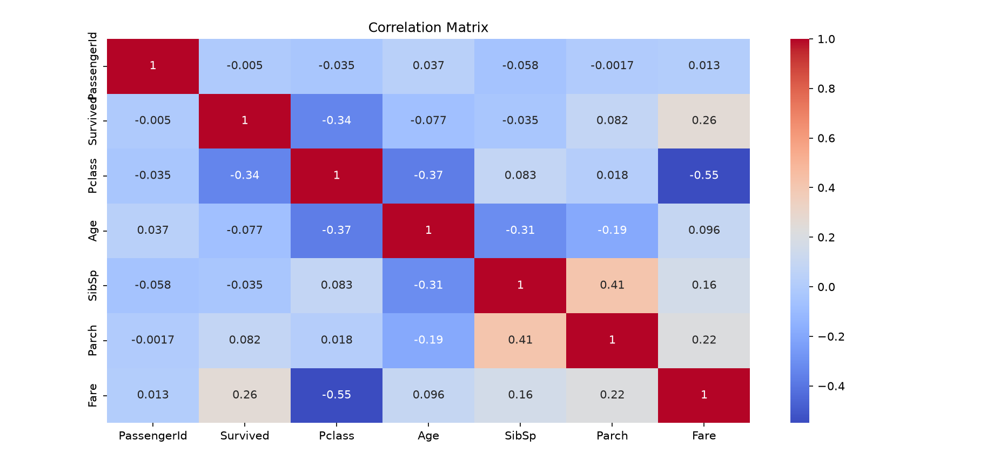

# Titanic Exploratory Data Analysis (EDA)

##  Project Overview
This project analyzes the Titanic dataset using Python to explore passenger information, identify survival patterns, clean missing data, and visualize important insights.

##  Tools Used
- Python
- Pandas
- Matplotlib
- Seaborn

##  Project Steps
- Load the dataset
- Explore the data
- Analyze missing values
- Create visualizations
- Perform correlation analysis
- Clean the dataset
- Save the cleaned dataset

##  Key Insights
- Female passengers had the highest survival rate (~74%).
- Most passengers traveled in Third Class.
- First Class passengers had a higher survival rate than Third Class.
- Male passengers were more than female passengers.
- The Fare column contained significant outliers.

##  Files
- Titanic_EDA.py
- titanic_cleaned.csv

## Sample Visualizations

### Age Distribution

### Survival by Gender

### Correlation Heatmap

##  Author
Abdelrahman Ashraf
